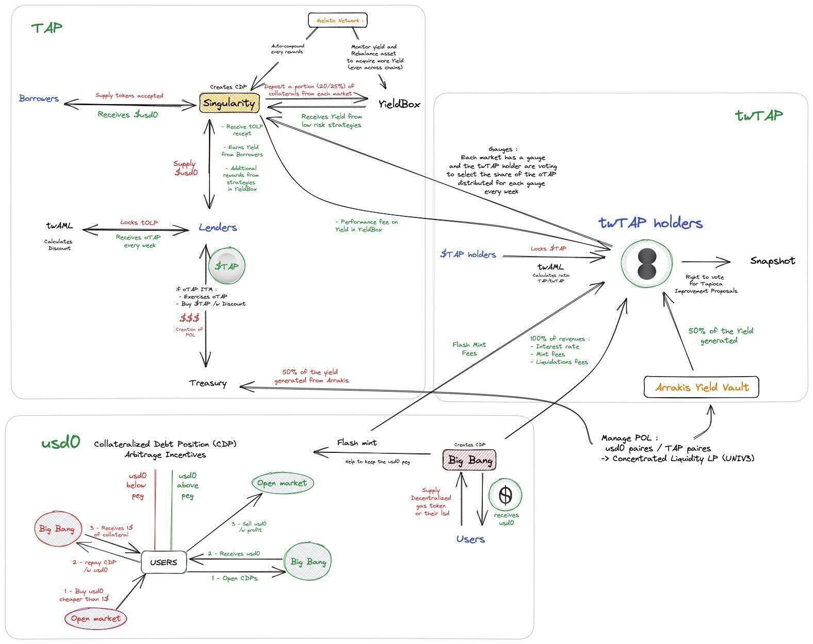

# ✨ So you want to run an audit

This `README.md` contains a set of checklists for our audit collaboration.

Your audit will use two repos: 
- **an _audit_ repo** (this one), which is used for scoping your audit and for providing information to wardens
- **a _findings_ repo**, where issues are submitted (shared with you after the audit) 

Ultimately, when we launch the audit, this repo will be made public and will contain the smart contracts to be reviewed and all the information needed for audit participants. The findings repo will be made public after the audit report is published and your team has mitigated the identified issues.

Some of the checklists in this doc are for **C4 (🐺)** and some of them are for **you as the audit sponsor (⭐️)**.

---
# Repo setup

## ⭐️ Sponsor: Add code to this repo

- [ ] Create a PR to this repo with the below changes:
- [ ] Provide a self-contained repository with working commands that will build (at least) all in-scope contracts, and commands that will run tests producing gas reports for the relevant contracts.
- [ ] Make sure your code is thoroughly commented using the [NatSpec format](https://docs.soliditylang.org/en/v0.5.10/natspec-format.html#natspec-format).
- [ ] Please have final versions of contracts and documentation added/updated in this repo **no less than 24 hours prior to audit start time.**
- [ ] Be prepared for a 🚨code freeze🚨 for the duration of the audit — important because it establishes a level playing field. We want to ensure everyone's looking at the same code, no matter when they look during the audit. (Note: this includes your own repo, since a PR can leak alpha to our wardens!)


---

## ⭐️ Sponsor: Edit this README

Under "SPONSORS ADD INFO HERE" heading below, include the following:

- [ ] Modify the bottom of this `README.md` file to describe how your code is supposed to work with links to any relevent documentation and any other criteria/details that the C4 Wardens should keep in mind when reviewing. ([Here's a well-constructed example.](https://github.com/code-423n4/2022-08-foundation#readme))
  - [ ] When linking, please provide all links as full absolute links versus relative links
  - [ ] All information should be provided in markdown format (HTML does not render on Code4rena.com)
- [ ] Under the "Scope" heading, provide the name of each contract and:
  - [ ] source lines of code (excluding blank lines and comments) in each
  - [ ] external contracts called in each
  - [ ] libraries used in each
- [ ] Describe any novel or unique curve logic or mathematical models implemented in the contracts
- [ ] Does the token conform to the ERC-20 standard? In what specific ways does it differ?
- [ ] Describe anything else that adds any special logic that makes your approach unique
- [ ] Identify any areas of specific concern in reviewing the code
- [ ] Review the Gas award pool amount. This can be adjusted up or down, based on your preference - just flag it for Code4rena staff so we can update the pool totals across all comms channels. 
- [ ] Optional / nice to have: pre-record a high-level overview of your protocol (not just specific smart contract functions). This saves wardens a lot of time wading through documentation.
- [ ] See also: [this checklist in Notion](https://code4rena.notion.site/Key-info-for-Code4rena-sponsors-f60764c4c4574bbf8e7a6dbd72cc49b4#0cafa01e6201462e9f78677a39e09746)
- [ ] Delete this checklist and all text above the line below when you're ready.

---

# Tapioca audit details
- Total Prize Pool: XXX XXX USDC (Notion: Total award pool)
  - HM awards: XXX XXX USDC (Notion: HM (main) pool)
  - Analysis awards: XXX XXX USDC (Notion: Analysis pool)
  - QA awards: XXX XXX USDC (Notion: QA pool)
  - Bot Race awards: XXX XXX USDC (Notion: Bot Race pool)
  - Gas awards: XXX XXX USDC (Notion: Gas pool)
  - Judge awards: XXX XXX USDC (Notion: Judge Fee)
  - Lookout awards: XXX XXX USDC (Notion: Sum of Pre-sort fee + Pre-sort early bonus)
  - Scout awards: $500 USDC (Notion: Scout fee - but usually $500 USDC)
  - Mitigation Review: XXX XXX USDC (*Opportunity goes to top 3 certified wardens based on placement in this audit.*)
- Join [C4 Discord](https://discord.gg/code4rena) to register
- Submit findings [using the C4 form](https://code4rena.com/contests/2023-07-tapioca/submit)
- [Read our guidelines for more details](https://docs.code4rena.com/roles/wardens)
- Starts July 05, 2023 20:00 UTC 
- Ends July 19, 2023 20:00 UTC 

## Automated Findings / Publicly Known Issues

Automated findings output for the audit can be found [here](add link to report) within 24 hours of audit opening.

*Note for C4 wardens: Anything included in the automated findings output is considered a publicly known issue and is ineligible for awards.*

[ ⭐️ SPONSORS ADD INFO HERE ]

# Overview

The Tapioca protocol is built with a lot of different smart contracts, scattered across 5 repositories.
It's an _Omnichain_ protocol working the LayerZero messaging layer. At its core, Tapioca ERC20/ERC721 contracts uses the LayerZero [OFTv2](https://github.com/LayerZero-Labs/solidity-examples/blob/main/contracts/token/oft/v2/OFTV2.sol) and [ONFT721](https://github.com/LayerZero-Labs/solidity-examples/blob/main/contracts/token/onft/ONFT721.sol) contracts.

The main repository is [tapioca-bar](./tapioca-bar-audit/), which contains [USDO](./tapioca-bar-audit/contracts/usd0/USDO.sol), a stablecoin. [BigBang](./tapioca-bar-audit/contracts/markets/bigBang/BigBang.sol), a CDP based contract that mint and burn `USDO`. And [Singularity](./tapioca-bar-audit/contracts/markets/singularity/Singularity.sol), a lending and borrowing platform.

The other repos are here to support the ecosystem as well as to create a synergy between the tokenemics and the protocol features.

* [tap-token](./tap-token-audit/) Contracts related to the tokenemics, is linked to `tapioca-bar` in an asymmetric way.
* [tapiocaz](./tapiocaz-audit/) Contracts that contains a wrapper named `TOFT`, which is used to wrap gas tokens and transfer allow their usage through the LayerZero network.
* [tapioca-periph](./tapioca-periph-audit/) Periphery contracts. The main contract is `MagnetarV2`, acts as a helper that reduce the number of user taken actions/transactions.
* [YieldBox](./YieldBox/) A "BentoBox v2". Acts as a vault, that allow for yield strategies to be applied on the asset.
* [yieldbox-strategies](./tapioca-yieldbox-strategies-audit/) Yield strategies that will be used by a YieldBox asset.



# Scope

*List all files in scope in the table below (along with hyperlinks) -- and feel free to add notes here to emphasize areas of focus.*

*For line of code counts, we recommend using [cloc](https://github.com/AlDanial/cloc).* 

## tapioca-bar
| Contract | SLOC | Purpose | Libraries used |  
| ----------- | ----------- | ----------- | ----------- |
| [./contracts/Penrose.sol](./contracts/Penrose.sol) | 377 | Owner contract for USDO & BB | [@boringcrypto/boring-solidity/contracts](https://github.com/boringcrypto/BoringSolidity)|
| [./contracts/markets/MarketERC20.sol](./contracts/markets/MarketERC20.sol) | 181 | Base contract for [Market.sol](./contracts/markets/Market.sol) | [@boringcrypto/boring-solidity/contracts](https://github.com/boringcrypto/BoringSolidity), [@openzeppelin/contracts/](https://www.openzeppelin.com/contracts) |
| [./contracts/markets/Market.sol](./contracts/markets/Market.sol) | 316 | Base contract for BigBang & Singularity | [@boringcrypto/boring-solidity/contracts](https://github.com/boringcrypto/BoringSolidity) |
| [./contracts/markets/singularity/SGLLiquidation.sol](./contracts/markets/singularity/SGLLiquidation.sol) | 288 | Singularity module for liquidations | |
| [./contracts/markets/singularity/SGLCommon.sol](./contracts/markets/singularity/SGLCommon.sol) | 209 | Singularity base contract | |
| [./contracts/markets/singularity/SGLLeverage.sol](./contracts/markets/singularity/SGLLeverage.sol) | 135 | Singularity module for leverage | |
| [./contracts/markets/singularity/SGLStorage.sol](./contracts/markets/singularity/SGLStorage.sol) | 121 | Singularity storage layout | [@boringcrypto/boring-solidity/contracts](https://github.com/boringcrypto/BoringSolidity) |
| [./contracts/markets/singularity/SGLLendingCommon.sol](./contracts/markets/singularity/SGLLendingCommon.sol) | 78 | Singularity base contract | |
| [./contracts/markets/singularity/SGLBorrow.sol](./contracts/markets/singularity/SGLBorrow.sol) | 31 | Singularity borrowing module  | |
| [./contracts/markets/singularity/SGLCollateral.sol](./contracts/markets/singularity/SGLCollateral.sol) | 22 | Singularity collateral module  | |
| [./contracts/markets/singularity/Singularity.sol](./contracts/markets/singularity/Singularity.sol) | 452 | Lending & borrowing | |
| [./contracts/usd0/BaseUSDOStorage.sol](./contracts/usd0/BaseUSDOStorage.sol) | 56 | Base USDO contract | [@openzeppelin/contracts/](https://www.openzeppelin.com/contracts) |
| [./contracts/usd0/modules/USDOLeverageModule.sol](./contracts/usd0/modules/USDOLeverageModule.sol) | 277 | USDO Module for leverage | |
| [./contracts/usd0/modules/USDOOptionsModule.sol](./contracts/usd0/modules/USDOOptionsModule.sol) | 269 | USDO Module for [TapiocaBrokerOption.sol](./tap-token-audit/contracts/options/TapiocaOptionBroker.sol) calls | |
| [./contracts/usd0/modules/USDOMarketModule.sol](./contracts/usd0/modules/USDOMarketModule.sol) | 268 | USDO Module for Singularity | [@boringcrypto/boring-solidity/contracts](https://github.com/boringcrypto/BoringSolidity) |
| [./contracts/usd0/BaseUSDO.sol](./contracts/usd0/BaseUSDO.sol) | 358 | Custom LayerZero OFT logic, inherited in USDO | [@openzeppelin/contracts/](https://www.openzeppelin.com/contracts) |
| [./contracts/usd0/USDO.sol](./contracts/usd0/USDO.sol) | 69 | USDO stablecoin |  |
| [./contracts/markets/bigBang/BigBang.sol](./contracts/markets/bigBang/BigBang.sol) | 555 | Mint and burn USDO through CDP | [@boringcrypto/boring-solidity/contracts](https://github.com/boringcrypto/BoringSolidity) |


## tapiocaz
| Contract | SLOC | Purpose | Libraries used |  
| ----------- | ----------- | ----------- | ----------- |
| [./contracts/tOFT/BaseTOFTStorage.sol](./contracts/tOFT/BaseTOFTStorage.sol) | 55 | Base TOFT EVM storage layout | [@openzeppelin/contracts/](https://www.openzeppelin.com/contracts) |
| [./contracts/tOFT/BaseTOFT.sol](./contracts/tOFT/BaseTOFT.sol) | 455 | Base TOFT contract | |
| [./contracts/tOFT/modules/BaseTOFTLeverageModule.sol](./contracts/tOFT/modules/BaseTOFTLeverageModule.sol) | 305 | Base TOFT leverage module | |
| [./contracts/tOFT/modules/BaseTOFTMarketModule.sol](./contracts/tOFT/modules/BaseTOFTMarketModule.sol) | 285 | Base TOFT Singularity market module | |
| [./contracts/tOFT/modules/BaseTOFTOptionsModule.sol](./contracts/tOFT/modules/BaseTOFTOptionsModule.sol) | 283 | Base TOFT TapiocaOptionBroker market module | |
| [./contracts/tOFT/modules/BaseTOFTStrategyModule.sol](./contracts/tOFT/modules/BaseTOFTStrategyModule.sol) | 203 | Base TOFT YieldBox module | |
| [./contracts/TapiocaWrapper.sol](./contracts/TapiocaWrapper.sol) | 141 | TOFT create2 deployer | [@openzeppelin/contracts/](https://www.openzeppelin.com/contracts) |
| [./contracts/Balancer.sol](./contracts/Balancer.sol) | 223 | Contract that balance out a mTapiocaOFT supply | [@openzeppelin/contracts/](https://www.openzeppelin.com/contracts), [@rari-capital/solmate](https://github.com/transmissions11/solmate)  |
| [./contracts/tOFT/mTapiocaOFT.sol](./contracts/tOFT/mTapiocaOFT.sol) | 94 | Special TOFT implementation that can balance its supply | |
| [./contracts/tOFT/TapiocaOFT.sol](./contracts/tOFT/TapiocaOFT.sol) | 55 | OFTv2 compliant wrapped token, with new custom functions | |

## tap-token
| Contract | SLOC | Purpose | Libraries used |  
| ----------- | ----------- | ----------- | ----------- |
| [./contracts/Vesting.sol](./contracts/Vesting.sol) | 94 | Vesting contract | [@boringcrypto/boring-solidity/contracts](https://github.com/boringcrypto/BoringSolidity), [@openzeppelin/contracts/](https://www.openzeppelin.com/contracts) |
| [././contracts/twAML.sol](././contracts/twAML.sol) | 94 | Math library | |
| [./contracts/governance/twTAP.sol](./contracts/governance/twTAP.sol) | 341 | ONFT721 governance token | [@openzeppelin/contracts/](https://www.openzeppelin.com/contracts) |
| [./contracts/tokens/BaseTapOFT.sol](./contracts/tokens/BaseTapOFT.sol) | 264 | Base TapOFT contract | [@openzeppelin/contracts/](https://www.openzeppelin.com/contracts) |
| [./contracts/tokens/TapOFT.sol](./contracts/tokens/TapOFT.sol) | 127 | Tapioca protocol token | [@openzeppelin/contracts/](https://www.openzeppelin.com/contracts) |
| [./contracts/option-airdrop/aoTAP.sol](./contracts/option-airdrop/aoTAP.sol) | 88 | Forked version of oTAP | [@boringcrypto/boring-solidity/contracts](https://github.com/boringcrypto/BoringSolidity), [@openzeppelin/contracts/](https://www.openzeppelin.com/contracts) |
| [./contracts/tokens/LTap.sol](./contracts/tokens/LTap.sol) | 30 | ERC20 aoTAP 1:1 redeemer | [@boringcrypto/boring-solidity/contracts](https://github.com/boringcrypto/BoringSolidity), [@openzeppelin/contracts/](https://www.openzeppelin.com/contracts) |
| [./contracts/option-airdrop/AirdropBroker.sol](./contracts/option-airdrop/AirdropBroker.sol) | 338 | Smaller version of TapiocaOptionBroker to mint & exercise LTAP | [@boringcrypto/boring-solidity/contracts](https://github.com/boringcrypto/BoringSolidity), [@openzeppelin/contracts/](https://www.openzeppelin.com/contracts) |
| [./contracts/options/oTAP.sol](./contracts/options/oTAP.sol) | 75 | ERC721 Option meta contract | [@boringcrypto/boring-solidity/contracts](https://github.com/boringcrypto/BoringSolidity), [@openzeppelin/contracts/](https://www.openzeppelin.com/contracts) |
| [./contracts/options/TapiocaOptionLiquidityProvision.sol](./contracts/options/TapiocaOptionLiquidityProvision.sol) | 248 | Singularity ERC20 receipt token vault| [@boringcrypto/boring-solidity/contracts](https://github.com/boringcrypto/BoringSolidity), [@openzeppelin/contracts/](https://www.openzeppelin.com/contracts) |
| [./contracts/options/TapiocaOptionBroker.sol](./contracts/options/TapiocaOptionBroker.sol) | 398 | Mint & exercise oTAP | [@boringcrypto/boring-solidity/contracts](https://github.com/boringcrypto/BoringSolidity), [@openzeppelin/contracts/](https://www.openzeppelin.com/contracts) |

## tapioca-periph
| Contract | SLOC | Purpose | Libraries used |  
| ----------- | ----------- | ----------- | ----------- |
| [./contracts/Magnetar/modules/MagnetarMarketModule.sol](./contracts/Magnetar/modules/MagnetarMarketModule.sol) | 656 | Magnetar Singularity module | [@openzeppelin/contracts/](https://www.openzeppelin.com/contracts)  |
| [./contracts/Magnetar/MagnetarV2.sol](./contracts/Magnetar/MagnetarV2.sol) | 888 | Helper contract that interacts with Singularity, BigBang, TapiocaOptionBroker | [@openzeppelin/contracts/](https://www.openzeppelin.com/contracts)  |
| [./contracts/Magnetar/MagnetarV2Storage.sol](./contracts/Magnetar/MagnetarV2Storage.sol) | 284 | Magnetar storage layout| [@boringcrypto/boring-solidity/contracts](https://github.com/boringcrypto/BoringSolidity) |
| [./contracts/Swapper/BaseSwapper.sol](./contracts/Swapper/BaseSwapper.sol) | 151 | Base swapper contract for other swapper contract|  [@openzeppelin/contracts/](https://www.openzeppelin.com/contracts) |
| [./contracts/Swapper/UniswapV3Swapper.sol](./contracts/Swapper/UniswapV3Swapper.sol) | 142 | UniV3 swapper contract|  [@openzeppelin/contracts/](https://www.openzeppelin.com/contracts), [@uniswap/v3-core/](https://github.com/Uniswap/v3-core) [@uniswap/v3-periphery/](https://github.com/Uniswap/v3-periphery) |
| [./contracts/Swapper/UniswapV2Swapper.sol](./contracts/Swapper/UniswapV2Swapper.sol) | 121 | UniV2 swapper contract|  |
| [./contracts/Swapper/CurveSwapper.sol](./contracts/Swapper/CurveSwapper.sol) | 108 | Curve swapper contract | [@openzeppelin/contracts/](https://www.openzeppelin.com/contracts) |
| [./contracts/oracle/implementations/ARBTriCryptoOracle.sol](./contracts/oracle/implementations/ARBTriCryptoOracle.sol) | 87 | TriCrypto oracle | [@openzeppelin/contracts/](https://www.openzeppelin.com/contracts), [solady/](https://github.com/Vectorized/solady), [@chainlink/](https://github.com/smartcontractkit/chainlink) |
| [./contracts/Multicall/Multicall3.sol](./contracts/Multicall/Multicall3.sol) | 72 | Multicall contract | [@openzeppelin/contracts/](https://www.openzeppelin.com/contracts) |
| [./contracts/oracle/Seer.sol](./contracts/oracle/Seer.sol) | 66 | Oracle contract, uses best of ChainLink/UniV3 price feed | |
| [./contracts/oracle/implementations/SGOracle.sol](./contracts/oracle/implementations/SGOracle.sol) | 57 | Stargate finance oracle |[@chainlink/](https://github.com/smartcontractkit/chainlink) |
| [./contracts/TapiocaDeployer/TapiocaDeployer.sol](./contracts/TapiocaDeployer/TapiocaDeployer.sol) | 52 | Tapioca contract deployer|  |
| [./contracts/oracle/implementations/GLPOracle.sol](./contracts/oracle/implementations/GLPOracle.sol) | 38 | GLP Oracle| |


## yieldbox
| Contract | SLOC | Purpose | Libraries used |  
| ----------- | ----------- | ----------- | ----------- |
| [./contracts/YieldBox.sol](./contracts/YieldBox.sol) | 263 | Main Yieldbox contract | [@boringcrypto/boring-solidity/contracts](https://github.com/boringcrypto/BoringSolidity), [@openzeppelin/contracts/](https://www.openzeppelin.com/contracts)  |
| [./contracts/YieldBoxURIBuilder.sol](./contracts/YieldBoxURIBuilder.sol) | 123 | Inherited by YieldBox | [@boringcrypto/boring-solidity/contracts](https://github.com/boringcrypto/BoringSolidity), [@openzeppelin/contracts/](https://www.openzeppelin.com/contracts)  |
| [./contracts/NativeTokenFactory.sol](./contracts/NativeTokenFactory.sol) | 72 | Creates ERC1155 tokens |  |
| [./contracts/YieldBoxPermit.sol](./contracts/YieldBoxPermit.sol) | 67 | EIP-2612 for YieldBox | [@openzeppelin/contracts/](https://www.openzeppelin.com/contracts)  |
| [./contracts/YieldBoxRebase.sol](./contracts/YieldBoxRebase.sol) | 64 | Math lib for internal accounting | [@boringcrypto/boring-solidity/contracts](https://github.com/boringcrypto/BoringSolidity) |
| [./contracts/BoringMath.sol](./contracts/BoringMath.sol) | 26 | Simple math lib | |

## Out of scope

- [@boringcrypto/boring-solidity/contracts](https://github.com/boringcrypto/BoringSolidity)
- [@openzeppelin/contracts/](https://www.openzeppelin.com/contracts)
- [@chainlink/](https://github.com/smartcontractkit/chainlink)
- [solady/](https://github.com/Vectorized/solady)
- [@rari-capital/solmate](https://github.com/transmissions11/solmate)

# Additional Context

twAML is a simple model that is used in `twTAP` and `TapiocaOptionBroker`. A detailed explanation of how it works can be found [here](https://docs.tapioca.xyz/tapioca/core-technologies/twaml).

## Scoping Details 
```
- If you have a public code repo, please share it here:  https://github.com/Tapioca-DAO/Tapioca-bar https://github.com/Tapioca-DAO/tap-token https://github.com/Tapioca-DAO/TapiocaZ https://github.com/Tapioca-DAO/tapioca-yieldbox-strategies https://github.com/Tapioca-DAO/YieldBox
- How many contracts are in scope?:   62
- Total SLoC for these contracts?:  12711
- How many external imports are there?: 10 
- How many separate interfaces and struct definitions are there for the contracts within scope?:  50
- Does most of your code generally use composition or inheritance?:   Inheritance
- How many external calls?:   10
- What is the overall line coverage percentage provided by your tests?:  90
- Is there a need to understand a separate part of the codebase / get context in order to audit this part of the protocol?:   
- Please describe required context:   
- Does it use an oracle?:  
- Does the token conform to the ERC20 standard?:  True / also non-ERC20 token
- Are there any novel or unique curve logic or mathematical models?: 
- Does it use a timelock function?:  True
- Is it an NFT?: 
- Does it have an AMM?:   
- Is it a fork of a popular project?: True; Heavily modified version of Kashi lending & borrowing. It implements a new Permit system for both lending & borrowing actions, a new liquidation system and a module based architecture.
- Does it use rollups?:   
- Is it multi-chain?:  True
- Does it use a side-chain?: False
- Describe any specific areas you would like addressed. E.g. Please try to break XYZ.":
Tap-Token repo: 
Integrity of twAML model within the used contracts (TapiocaOptionBroker, TapiocaDAOPortal). 
Correct user participation and exit on twAML contracts (tOB, tDP). 
Proper OTC deal execution on tOB. 

Tapioca-Bar repo:
Lending & borrowing mechanism.
Function access with lend/borrow approval/permit.
Closed liquidations.

TapiocaZ repo:
mTapiocaOFT/Balancer contract balancing mechanism.
```

# Tests

## Hardhat tests:

### Setup
```
yarn
npx hardhat compile
```
### Test
```
npx hardhat test
```

### Gas cost
Set `enabled` key to `true` in `hardhat.export.ts>config.gasReporter`
```ts
  gasReporter: {
      enabled: true,
  }
```

# Notes
- `MagnetarV2` does not have access control by design. The underlying is the one that implement those (Can be found on `TOFT`, `Singularity`, `USDO`, `TapiocaOptionBroker`).
- Re-entrency on ownable contract should be considered as a vulnerability only if the last call leads to an external call with potential vulnerability.